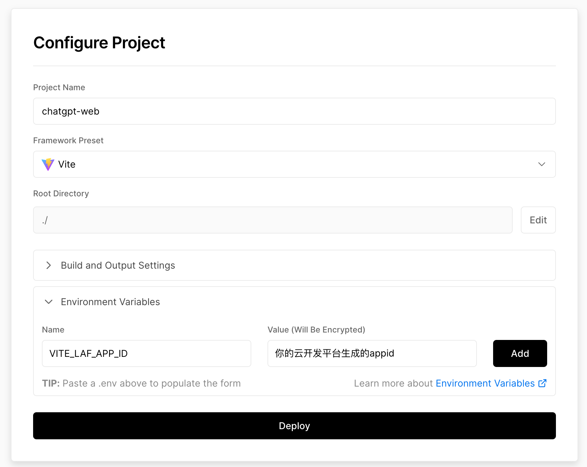

# web-chatgpt
一个简易的网页版chatgpt，预览：[https://chatgpt.liushuaiyang.com](http://chatgpt.liushuaiyang.com)

下面讲一讲怎么实现的

## 接口开发
项目中使用的接口使用的是一个云开发平台：[laf](https://laf.dev/) 平台会赠送一些免费额度
> 具体操作可以参考  [三分钟搭建一个自己的 ChatGPT ](https://juejin.cn/post/7209839961439371320)

## 前端开发
- 可以自己开发全部页面，不过多阐述
- 不想自己动手，可以直接 fork 项目代码到自己的仓库
   - 在本地把项目克隆下来 `git clone`，下载依赖 `yarn`
   - 在项目的根目录新建一个 `.env.local` 或者 `.env` 文件，然后添加一个环境变量[（vite设置环境变量）](https://cn.vitejs.dev/guide/env-and-mode.html#env-variables-and-modes) `VITE_LAF_APP_ID = '你的云开发平台的appid' `
   - 配置好之后直接：`yarn start`

## 部署
- **推荐使用** [vercel](https://vercel.com/) 进行部署，可以设置部署时的环境变量，并且支持自动化部署（在github提交代码，自动部署）
  - 登录网站，注册账号
  - 创建项目，导入刚刚fork的github仓库
  - 填写项目名、构建部分不需要设置（vercel会检测到你的项目时vite，自动帮你设置）
  - **重点来了，设置环境变量**：`name: VITE_LAF_APP_ID` `value: 你的云开发平台的appid`，设置完后，vercel会帮你生成一个.env文件，用于vite构建时获取，并且，value会被vercel加密
  
  - 点击部署，稍等片刻，就部署成功了，vercel会自动生成一个域名，你也可以绑定自定义域名
  - 绑定自定义域名：vercel在国内是被墙的，没有代理无法访问，想要解决这个问题：你需要绑定一个自定义域名，绑定完后vercel会自动给你的域名加上一个SSL证书，然后就可以在国内使用https的方式进行访问，速度也非常快
- github Pages，不推荐使用，因为这样会把你的 `appid` 暴露到github上